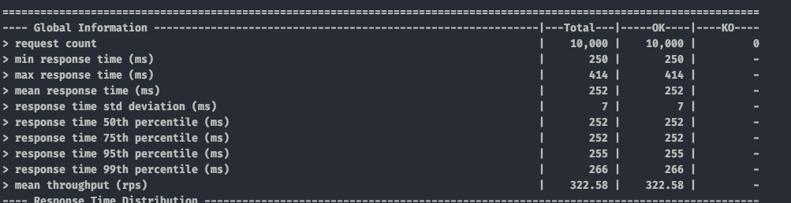
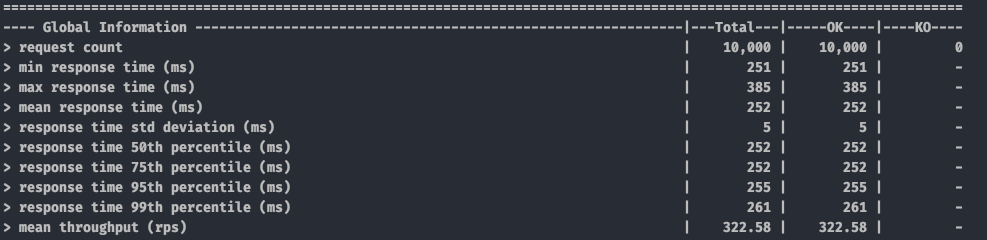
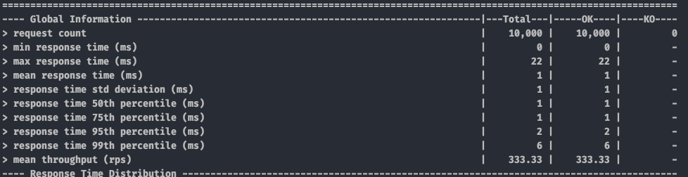
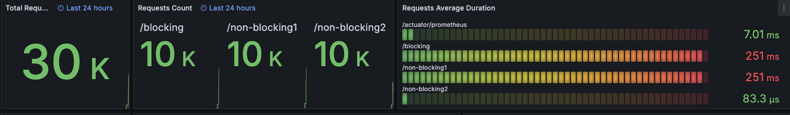
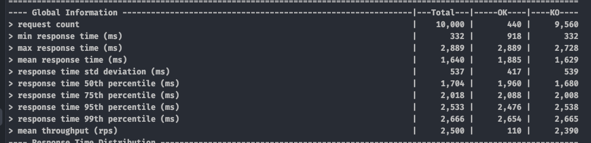
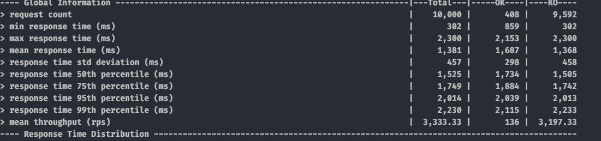

# Blocking Thread, Async Thread, Coroutine 성능 테스트

---
시나리오: 외부 API 호출 시 100ms 소요, 10_000 명의 유저가 30초동안 점진적으로 요청 시 결과 

**blocking thread** 
  

**@Async Thread** 
 br>

**Coroutine** 
  

**Monitoring**

---
시나리오: 외부 API 호출 시 100ms 소요, 10_000 명의 유저가 동시에 요청 시 결과 
**blocking thread** 

**@Async Thread** 

**Coroutine** 

---
시나리오: 외부 API 호출 시 100ms 소요, 초당 1_000 명의 유저가 60초동안 요청 시 결과 
**blocking thread** 
Container shutdown 

**@Async Thread** 
Container shutdown 

**Coroutine** 
